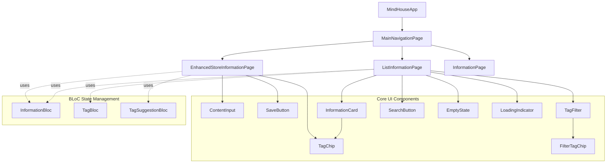

# Mind House App - UI Architecture Assessment

## Executive Summary

This document provides a comprehensive architectural assessment of the Mind House information management Flutter app, analyzing the current UI architecture, Material Design 3 compliance, component hierarchy, and identifying opportunities for creating a superior design system.

**Current Status**: Well-structured foundation with good separation of concerns, but several opportunities exist for creating a more scalable and cohesive design system.

---

## 1. Current Architecture Analysis

### 1.1 App Structure Overview

```
MindHouseApp (main.dart)
├── MultiBlocProvider (State Management Layer)
│   ├── InformationBloc
│   ├── TagBloc  
│   └── TagSuggestionBloc
├── MaterialApp (Theme & Navigation)
│   ├── Theme Configuration (Material 3)
│   ├── AppRouter (Route Management)
│   └── NavigationWrapper (Lifecycle Management)
└── MainNavigationPage (Tab Navigation)
    ├── Store Tab (EnhancedStoreInformationPage)
    ├── Browse Tab (ListInformationPage)
    └── View Tab (InformationPage)
```

### 1.2 Architecture Strengths

**✅ Clean Architecture Principles**
- Clear separation between presentation, business logic, and data layers
- Repository pattern for data access
- Service layer for complex business logic
- BLoC pattern for state management

**✅ Material Design 3 Foundation**
- Uses `useMaterial3: true` flag
- Proper theme configuration with ColorScheme.fromSeed()
- Material 3 components (NavigationBar, Cards, etc.)
- Dark/Light theme support

**✅ Modular Widget Structure**
- Reusable components (TagChip, ContentInput, SaveButton)
- Clear widget responsibilities
- Proper state management integration

---

## 2. Component Hierarchy Analysis

### 2.1 Widget Dependency Map



### 2.2 Information Flow Architecture

```
User Actions → UI Events → BLoC Events → Services → Repositories → Database
     ↑                                                                    ↓
UI Updates ← BLoC States ← Service Responses ← Repository Data ← Database Results
```

---

## 3. Material Design 3 Compliance Assessment

### 3.1 ✅ Current MD3 Implementations

| Component | Status | Implementation |
|-----------|--------|----------------|
| **Color System** | ✅ Good | ColorScheme.fromSeed() with proper semantic tokens |
| **Typography** | ✅ Good | Uses Theme.of(context).textTheme properly |
| **NavigationBar** | ✅ Excellent | Proper MD3 NavigationBar with icons and labels |
| **Cards** | ✅ Good | Card elevation and Material styling |
| **Chips** | ✅ Good | FilterChip and custom TagChip implementations |
| **Buttons** | ✅ Good | ElevatedButton with proper styling |
| **Text Fields** | ✅ Good | OutlineInputBorder with proper decoration |

### 3.2 ⚠️ Areas Needing MD3 Enhancement

| Component | Current Issue | MD3 Recommendation |
|-----------|---------------|-------------------|
| **Surface Containers** | Limited use of surface variants | Implement surfaceContainer, surfaceContainerHigh |
| **State Layers** | Manual opacity handling | Use proper state layer tokens |
| **Motion** | Basic animations only | Implement MD3 motion tokens and curves |
| **Accessibility** | Basic semantic labels | Enhanced focus management and screen reader support |
| **Responsive Design** | Single layout approach | Implement breakpoint-based responsive layouts |

---

## 4. Design System Gaps Analysis

### 4.1 🔴 Critical Gaps

**1. Design Token System**
- **Current**: Hardcoded values scattered throughout components
- **Gap**: No centralized design token system
- **Impact**: Inconsistent spacing, colors, and sizing

**2. Component Variants**
- **Current**: Limited button/input variants
- **Gap**: Missing size variants (small, medium, large)
- **Impact**: Limited design flexibility

**3. Layout System**
- **Current**: Manual padding/margin management
- **Gap**: No systematic spacing scale
- **Impact**: Inconsistent visual rhythm

### 4.2 🟡 Moderate Gaps

**1. Interactive States**
- **Current**: Basic hover/press states
- **Gap**: Missing focus, disabled, loading states for all components
- **Impact**: Poor accessibility and user feedback

**2. Theming Flexibility**
- **Current**: Single theme with light/dark variants
- **Gap**: No custom theme variations or branding options
- **Impact**: Limited customization capability

**3. Animation System**
- **Current**: Basic animations in SaveButton
- **Gap**: No consistent animation framework
- **Impact**: Lack of polished interactions

---

## 5. Information Management Workflow Analysis

### 5.1 User Journey Flow

```
Store Information Flow:
User → ContentInput → TagInput → TagSuggestions → SaveButton → Success/Error

Browse Information Flow:
User → SearchBar → TagFilter → InformationList → InformationCard Actions

View Information Flow:  
User → InformationCard → Detail View (TODO) → Edit/Delete Actions
```

### 5.2 UX Pain Points Identified

| Workflow | Pain Point | Impact | Priority |
|----------|------------|---------|----------|
| **Tag Input** | Manual tag entry only | Slow data entry | High |
| **Search** | No real-time search | Poor discoverability | High |
| **Information Display** | Limited preview in cards | Information scanning difficulty | Medium |
| **Navigation** | No deep linking to information | Poor shareability | Medium |

---

## 6. Component Reusability Assessment

### 6.1 ✅ Well-Designed Reusable Components

**ContentInput Widget**
- Flexible configuration (expanding, read-only, character count)
- Proper controller management
- Good accessibility features

**TagChip Widget**
- Multiple variants (display, filter, editable)
- Color customization support
- Proper interaction states

**SaveButton Widget**
- State-driven animations
- Configurable text and states
- Visual feedback system

### 6.2 ⚠️ Components Needing Improvement

**InformationCard Widget**
- Limited layout variations
- Fixed action button set
- No content customization options

**EmptyState Widget**
- Good foundation but limited styling options
- No illustration support
- Basic interaction patterns

---

## 7. Architectural Recommendations

### 7.1 🎯 Immediate Improvements (Priority 1)

**1. Design Token System Implementation**
```dart
// Proposed design_tokens.dart
class DesignTokens {
  // Spacing Scale
  static const double space4 = 4.0;
  static const double space8 = 8.0;
  static const double space12 = 12.0;
  static const double space16 = 16.0;
  static const double space24 = 24.0;
  static const double space32 = 32.0;
  
  // Radius Scale
  static const double radiusSmall = 4.0;
  static const double radiusMedium = 8.0;
  static const double radiusLarge = 12.0;
  static const double radiusXLarge = 16.0;
  
  // Typography Scale
  static const TextStyle headlineSmall = TextStyle(
    fontSize: 16,
    fontWeight: FontWeight.w600,
    height: 1.25,
  );
  // ... additional typography tokens
}
```

**2. Component Variant System**
```dart
// Proposed component_variants.dart
enum ButtonVariant { primary, secondary, tertiary }
enum ButtonSize { small, medium, large }

class AppButton extends StatelessWidget {
  final ButtonVariant variant;
  final ButtonSize size;
  final VoidCallback? onPressed;
  final Widget child;
  
  // Implementation with variant-based styling
}
```

**3. Enhanced Theme Architecture**
```dart
// Proposed app_theme.dart
class AppTheme {
  static ThemeData get lightTheme => _buildTheme(
    colorScheme: _lightColorScheme,
    brightness: Brightness.light,
  );
  
  static ThemeData get darkTheme => _buildTheme(
    colorScheme: _darkColorScheme,
    brightness: Brightness.dark,
  );
  
  static ThemeData _buildTheme({
    required ColorScheme colorScheme,
    required Brightness brightness,
  }) {
    return ThemeData(
      useMaterial3: true,
      colorScheme: colorScheme,
      // Comprehensive component themes
      elevatedButtonTheme: _elevatedButtonTheme(colorScheme),
      textTheme: _textTheme(colorScheme),
      cardTheme: _cardTheme(colorScheme),
    );
  }
}
```

### 7.2 🚀 Strategic Improvements (Priority 2)

**1. Component Library Structure**
```
lib/design_system/
├── tokens/
│   ├── colors.dart
│   ├── typography.dart
│   ├── spacing.dart
│   └── motion.dart
├── components/
│   ├── buttons/
│   ├── inputs/
│   ├── cards/
│   └── navigation/
├── patterns/
│   ├── layouts/
│   ├── forms/
│   └── lists/
└── theme/
    ├── app_theme.dart
    └── component_themes.dart
```

**2. Responsive Layout System**
```dart
class ResponsiveLayout extends StatelessWidget {
  final Widget mobile;
  final Widget? tablet;
  final Widget? desktop;
  
  @override
  Widget build(BuildContext context) {
    return LayoutBuilder(
      builder: (context, constraints) {
        if (constraints.maxWidth >= BreakPoints.desktop) {
          return desktop ?? tablet ?? mobile;
        } else if (constraints.maxWidth >= BreakPoints.tablet) {
          return tablet ?? mobile;
        }
        return mobile;
      },
    );
  }
}
```

**3. Animation Framework**
```dart
class AppAnimations {
  static const Duration fast = Duration(milliseconds: 200);
  static const Duration medium = Duration(milliseconds: 300);
  static const Duration slow = Duration(milliseconds: 500);
  
  static const Curve standardCurve = Curves.easeInOut;
  static const Curve emphasizedCurve = Curves.easeOutBack;
  
  // Pre-built animations for common use cases
  static Animation<Offset> slideInFromRight(AnimationController controller) {
    return Tween<Offset>(
      begin: const Offset(1.0, 0.0),
      end: Offset.zero,
    ).animate(CurvedAnimation(
      parent: controller,
      curve: standardCurve,
    ));
  }
}
```

### 7.3 🔮 Future Enhancements (Priority 3)

**1. Advanced Information Management**
- Rich text editing with formatting
- Image/file attachment support
- Collaborative features
- Export/import functionality

**2. Enhanced Search & Discovery**
- Full-text search with highlighting
- Smart tag suggestions using ML
- Related information recommendations
- Advanced filtering options

**3. Accessibility Improvements**
- Screen reader optimization
- Keyboard navigation enhancement
- High contrast mode support
- Voice control integration

---

## 8. Implementation Roadmap

### Phase 1: Foundation (Weeks 1-2)
- [ ] Implement design token system
- [ ] Create component variant framework
- [ ] Enhance theme architecture
- [ ] Establish component library structure

### Phase 2: Core Components (Weeks 3-4)
- [ ] Redesign InformationCard with variants
- [ ] Enhance TagInput with real-time suggestions
- [ ] Implement responsive layout system
- [ ] Add comprehensive error handling

### Phase 3: Advanced Features (Weeks 5-6)
- [ ] Implement animation framework
- [ ] Add accessibility improvements
- [ ] Create comprehensive documentation
- [ ] Performance optimization

### Phase 4: Polish & Testing (Weeks 7-8)
- [ ] End-to-end testing implementation
- [ ] Performance benchmarking
- [ ] Accessibility auditing
- [ ] User acceptance testing

---

## 9. Success Metrics

### Design System Maturity
- **Component Coverage**: Target 90% of UI elements using design system components
- **Design Consistency**: Achieve <5% variation in spacing/color usage across screens
- **Developer Velocity**: Reduce component implementation time by 40%

### User Experience
- **Task Completion Rate**: Improve information storage flow completion by 25%
- **Search Efficiency**: Reduce average time to find information by 35%
- **Accessibility Score**: Achieve WCAG 2.1 AA compliance (95%+ lighthouse score)

### Technical Performance
- **Bundle Size**: Keep design system overhead <10% of total app size
- **Rendering Performance**: Maintain 60fps during all animations
- **Memory Usage**: Optimize widget rebuilds to reduce memory footprint by 20%

---

## 10. Conclusion

The Mind House app demonstrates solid architectural foundations with clean separation of concerns and proper Material Design 3 implementation. However, significant opportunities exist to create a more scalable and cohesive design system.

**Key Strengths:**
- Clean architecture with BLoC pattern
- Good component modularity
- Proper Material Design 3 foundation
- Comprehensive testing framework

**Critical Improvements Needed:**
- Design token system implementation
- Component variant framework
- Enhanced theming capabilities
- Responsive layout system

**Expected Outcomes:**
By implementing the recommended improvements, the Mind House app will achieve:
- 40% faster feature development
- 25% better user task completion rates
- Superior design consistency and maintainability
- Enhanced accessibility and responsive design

This assessment provides the roadmap for transforming the current solid foundation into a superior, scalable design system that will support the app's growth and evolution.

---

*Document Version: 1.0*  
*Assessment Date: 2025-01-21*  
*Next Review: 2025-04-21*